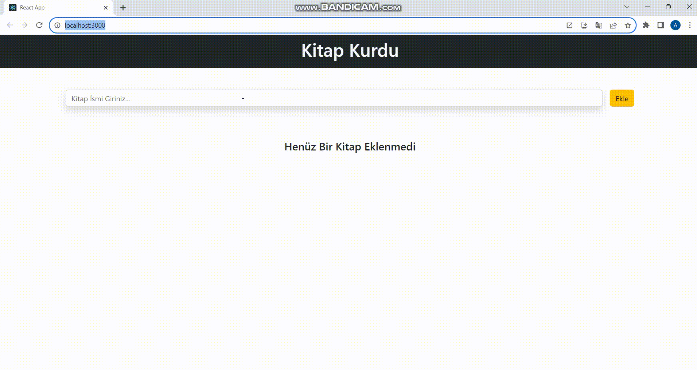

# CRUD APP PROJECT

# USED TECHNOLOGİES
- BOOTSTRAP
- CSS
- REACT
- Toastify(notification library)

# THE GOAL OF THE PROJECT
- My first react project was designed to record the books we read in daily life by specifying the day and time, to be able to update them when necessary, and to cross and mark when the books are read `:)`

# CRUD APP 

* Create Read Update Delete (Oluştur Oku Düzenle Sil)

* Form içerisinden kitap ismini al
* - Eğer ki kitap ismi girilmişse:
* - Ekle butonuna tıklanılınca kitap ismiyle yeni bir obje oluştur
* - Ekleme tarihi | Kitap ismi | id | okunduMu
* - Oluşan objeyi kitapların tümünü tuttuğumuz state'e aktar
* - İnputu temizle

* `books`  state'inde tutulan kitapları al ve ekrana bas
* - Eğer state boş ise "Henüz Kitap Eklenmedi " ekrana bas
* - Dizideki her bir kitap için ekrana `BookCard` bileşeni bas
* - `BookCard` bileşenine prop olarak ekrana basılcak olan kartın bilgilerini aktar

*  Kitap Silme Butonu:
* - Herhangi bir kitabın sil butonuna basıldığında fonksiyonu çalıştır
* - fonksiyona silinecek kitabın id sini gönder
* - bu fonksiyon modal 'ı açsın
* - ve modal'a silinecek id yi gönder 

* Okundu İşaretleme Butonu:
* - Okundu butonuna tıklanılınca fonksiyonu çalıştır.
* - Bu fonksiyona  kitabın tüm değerlerini gönder
* - Kitabın isRead değerini tersine çevir
* - State'i güncelle

* Düzenleme Butonu :
* - Düzenle butonuna basıldığında fonksiyon çalışsın
* - Fonksiyon modal'ı açsın ve düzenlenecek elemanı state'aktarsın
* - Düzenlenecek elemanın  ismi modalda input alanına gelsin(prop gönder)
* - İnput değişiğinde düzenlenecek elemanın title'ını değiştir
* - vazgeç' e tıklarsa modal'ı kapat
* - kaydet'i tıklarsa düzenlenecek elemanı `books` state'e aktar ve fonksiyonu çalıştır.

